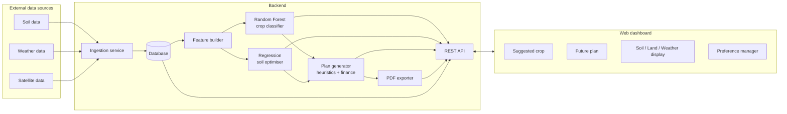
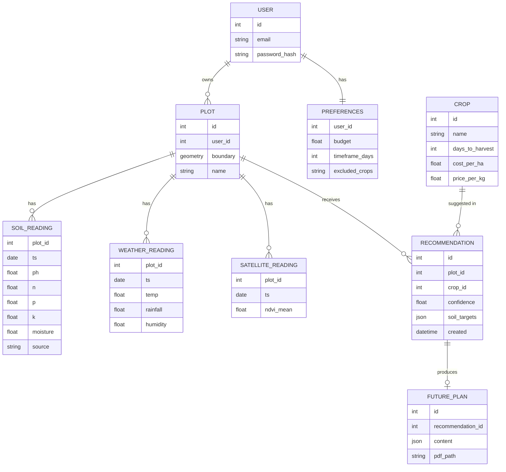
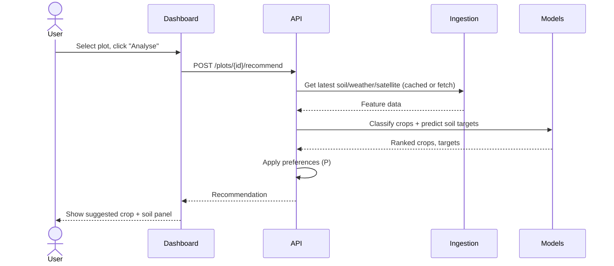

# Design - Crop Recommendation & Soil Health Dashboard

> Status: **Draft v0.1**. Companion to `requirements.md`. Technology choices marked **[proposed]** are suggestions for the team to confirm.

## 1. Context

The system takes soil, weather and satellite data for a user's plot, runs two ML models (crop classification and soil-target regression), and presents results in a dashboard with a generated, exportable future plan.

## 2. High-Level Architecture



### 2.1 Components

| Component | Responsibility |
|---|---|
| **Ingestion service** | Fetches soil, weather and satellite data for a plot; normalises units; caches results |
| **Feature builder** | Turns raw data into a single feature vector per plot (e.g. pH, N, P, K, avg temp, total rainfall, humidity, NDVI mean) |
| **Crop classifier** | Random Forest; outputs ranked crops with probabilities |
| **Soil optimiser** | Regression model(s); outputs numerical soil targets for the chosen crop |
| **Plan generator** | Combines model outputs, preferences (P), plant timeframes and cost data into a future plan |
| **PDF exporter** | Renders the future plan to PDF |
| **REST API** | Single entry point for the frontend |
| **Web dashboard** | UI with the four (five) dashboard panels |

## 3. Tech Stack [proposed]

| Layer | Choice | Reason |
|---|---|---|
| Frontend | React + a chart library (e.g. Recharts) + map library (e.g. Leaflet) | Common, good charting and map support |
| Backend / API | Python + FastAPI | Same language as the ML code; fast to build |
| ML | scikit-learn (`RandomForestClassifier`, `RandomForestRegressor` or `LinearRegression`) | Standard, well-documented |
| Database | PostgreSQL (+ PostGIS for plot geometry) | Relational data + spatial queries |
| PDF | WeasyPrint or ReportLab | Generate PDFs server-side from HTML/templates |
| Scheduling | Cron / APScheduler | Periodic weather & satellite refresh |

Candidate data sources **[to confirm coverage for our region]**: SoilGrids (global soil properties), Open-Meteo or OpenWeather (weather), Sentinel-2 via Copernicus / Sentinel Hub (satellite, NDVI).

**Weather - decided:** Open-Meteo (free, no API key, CORS-open forecast API).

**Soil - decided:** LRIS Portal / Fundamental Soil Layers (Manaaki Whenua - Landcare Research), via the backend.

**Satellite - decided:** Copernicus Data Space Ecosystem's Sentinel Hub-compatible Statistical API (Sentinel-2 L2A NDVI), via the backend - needs a free OAuth client, unlike weather.

See §14 for what's actually wired vs still simulated.

## 4. Data Model



## 5. ML Design

### 5.1 Crop classifier (Random Forest)

- **Task:** multi-class classification - features → crop label.
- **Features:** N, P, K, pH, soil moisture/texture, temperature, rainfall, humidity, NDVI (and any others the data supports).
- **Training data [TBD]:** a labelled crop-suitability dataset (public crop recommendation datasets exist that use N, P, K, temperature, humidity, pH and rainfall - a good starting point).
- **Output:** `predict_proba` → top-N crops with confidence.
- **Preference filtering:** after prediction, remove excluded crops and those that exceed budget or timeframe, then re-rank.
- **Explainability:** global feature importance from the forest; optionally SHAP values per prediction.
- **Evaluation:** train/test split + k-fold cross-validation; accuracy, per-class F1, confusion matrix.

### 5.2 Soil optimiser (Regression)

- **Task:** regression - predict continuous soil targets (e.g. ideal N, P, K, pH) for a crop given local conditions.
- **Note:** regression predicts *numbers*, not classes - the whiteboard's "classification based on numerical" is best treated as regression.
- **Approach options:**
  1. One `RandomForestRegressor` per target (simple, handles non-linearity).
  2. `MultiOutputRegressor` wrapping a single model.
- **Output:** target values → gap vs current soil → suggested amendments (via heuristic lookup table: amendment type, kg/ha per unit change, cost).
- **Evaluation:** MAE, RMSE, R².

### 5.3 Model lifecycle

- Models trained offline in notebooks/scripts, saved with `joblib`, versioned (e.g. `models/crop_rf_v1.joblib`).
- API loads the current version at startup; version stored on each `RECOMMENDATION` for traceability.

## 6. Future Plan Generation

Inputs: **cost (P)**, **input data**, **plant timeframes**.

| Section | How it's produced |
|---|---|
| Heuristics | Rule table per crop: sowing window, rotation advice, watering needs, warnings based on forecast |
| Graphs | Timeline (sow → harvest), projected soil nutrient levels, weather forecast vs crop needs |
| Effect on soil | Nutrient uptake per crop applied to current soil values → projected post-harvest soil |
| Potential yields / finances | `yield ≈ base_yield(crop) × suitability factor × area`; revenue = yield × price; margin = revenue − (crop cost + amendment cost) |

Plan is stored as JSON and rendered both in the dashboard and as a PDF (same template).

## 7. API Design [proposed]

| Method | Endpoint | Description |
|---|---|---|
| POST | `/auth/register`, `/auth/login` | Accounts |
| GET / PUT | `/preferences` | Read / update preferences (P) |
| POST | `/plots` | Create plot (name + GeoJSON boundary) |
| GET | `/plots/{id}/data` | Latest soil, weather, satellite data |
| POST | `/plots/{id}/recommend` | Run classifier + regressor, return ranked crops and soil targets |
| POST | `/recommendations/{id}/plan` | Generate future plan |
| GET | `/plans/{id}/pdf` | Download plan as PDF |

Example response for `/plots/{id}/recommend`:

```json
{
  "recommendation_id": 42,
  "model_version": "crop_rf_v1",
  "crops": [
    { "crop": "maize", "confidence": 0.71, "top_factors": ["rainfall", "N", "temperature"] },
    { "crop": "chickpea", "confidence": 0.14, "top_factors": ["pH", "humidity"] }
  ],
  "soil_targets": { "n": 80, "p": 40, "k": 20, "ph": 6.5 },
  "soil_gap": { "n": 15, "p": -5, "k": 0, "ph": 0.3 }
}
```

## 8. UI / Dashboard Layout

```
+-----------------------------------------------------------+
|  Plot selector ▾                         [Preferences ⚙]  |
+---------------------------+-------------------------------+
|  1. Suggested crop        |  3. Soil / Land / Weather     |
|  - Top crop + confidence  |  - Map with plot + NDVI layer |
|  - Why (key factors)      |  - Soil values vs targets     |
|  - Alternatives           |  - Weather trend / forecast   |
+---------------------------+-------------------------------+
|  2. Future plan                              [Export PDF] |
|  - Timeline graph   - Effect on soil   - Yield/finances   |
|  - Heuristic tips                                         |
+-----------------------------------------------------------+
|  4. Preference manager (modal/page): budget, timeframe,   |
|     crop include/exclude                                  |
+-----------------------------------------------------------+
```

## 9. Key Flows

**Get a recommendation**



## 10. Error Handling

- External API down → use cached data, show "data as of <date>" banner.
- Missing features → impute with regional defaults and flag low confidence, or ask the user to enter values.
- No crops pass preference filters → tell the user which preference excluded them and suggest relaxing it.

## 11. Testing Strategy

- **Unit:** feature builder, preference filter, finance calculations, heuristics rules.
- **Model:** held-out test metrics recorded per model version; minimum threshold gate before deployment.
- **Integration:** API endpoints with mocked external data sources.
- **UI:** key flows (create plot → recommend → plan → export PDF).

## 12. Future Work

- **Pest module:** pest risk model using crop + weather (humidity/temperature) + region; alerts on the dashboard.
- Mobile-friendly layout / app.
- IoT soil sensor integration for live soil readings.

## 13. Open Decisions

- Final data sources and their regional coverage.
- Training dataset for the classifier and regressor.
- Fifth dashboard component.
- Hosting (e.g. Render, Railway, university server).

## 14. Implementation status - what's actually live vs simulated

The demo dashboard (`frontend/index.html` + `js/app.js`, tabs Overview/Soil/Climate/Financials/Plan/Compare) and the separate **"Live backend"** tab (`js/live.js`) are two different data paths - see below for what each one actually is.

| Data | Status | Notes |
|---|---|---|
| **Weather - forecast (7-day / 14-day)** | **Live** | Climate tab fetches real forecast from Open-Meteo (`js/weather.js`) client-side - no backend involved. Each of the 4 demo paddocks now carries its own real `location`/`region` (Kōwhai Downs/Nelson, Ohaupo/Waikato, Lincoln/Canterbury, Mosgiel/Otago) - weather is fetched per paddock on selection, not from one shared app-wide default. Browser geolocation was tried and scrapped (real location doesn't make sense for a fixed demo paddock); falls back silently to the original static numbers per-paddock if a fetch fails (console warning only, no visible change). |
| **Weather - "Avg humidity" / "Avg temperature" KPI tiles** | **Live** (derived) | Averaged from the same live 7-day fetch above. |
| **Weather - Seasonal range, "Growing degree days", "Season rainfall" KPIs** | Still simulated | Would need an assumed season-start date and cumulative historical totals (Open-Meteo's archive API can supply the raw historical data for this - not yet wired). |
| **Soil / N-P-K / pH / crop scores / margins (Overview, Soil, Financials, Plan, Compare tabs)** | Simulated | Hardcoded `paddocks` array in `js/app.js` (4 fictional paddocks). Not connected to anything. |
| **`js/engine.js`, `charts.js`, `plan.js`, `data/crops.js`, `data/fields.js`** | Dead code | Not imported by `index.html` or `app.js` - have no effect on what's rendered. |
| **Soil properties (Live backend tab)** | **Live, real farmland data** | `GET/POST /plots/{id}/soil-properties[...]` calls the real FastAPI backend, which calls the real LRIS Portal (Manaaki Whenua - see `backend/README.md#soil-property-enrichment`) for Fundamental Soil Layers data (pH, organic carbon, CEC, available water, rooting depth, phosphate retention). The Live backend tab now follows whichever paddock is selected in the sidebar (`js/live.js`'s `activePlotId`, set by `js/app.js` on every paddock switch) rather than a single fixed plot - each of the 4 paddocks has its own real backend `Plot` row (`backend/scripts/ensure_paddock_plots.py`) at its real farmland coordinates, and all 4 have been pre-populated with real, distinct values (e.g. pH ranging 5.3-6.5 across the four regions). The original seed plot (id 1, urban Wellington) is no longer referenced by the frontend and correctly showed every property as `missing` when it was. |
| **Satellite / NDVI (Live backend tab)** | **Live, real farmland data** | `GET/POST /plots/{id}/satellite[...]` calls the real FastAPI backend, which calls the real Copernicus Data Space Ecosystem Statistical API (Sentinel-2 L2A, cloud-masked NDVI - see `backend/README.md#satellite-ndvi-enrichment`) and upserts into `satellite_readings`. Also now follows the selected paddock; all 4 paddock plots have real, distinct NDVI history (e.g. 0.38-0.92 across the four regions and dates). |
| **Weather backing `weather_readings` (Live backend tab + the recommend feature vector)** | **Live, real farmland data** | `GET/POST /plots/{id}/weather[...]` calls the real FastAPI backend, which calls Open-Meteo (free, no key - see `backend/README.md#weather-enrichment`) and upserts into `weather_readings`, the same table `app/services/feature_builder.py` reads temperature/humidity/rainfall from for `/plots/{id}/recommend`. Also now follows the selected paddock. Independent of the frontend's own Open-Meteo call (the Climate tab row above) - the backend queries it directly so recommend doesn't depend on the browser having asked first. |
| **Crop recommendation / soil targets (Live backend tab)** | Wired, currently broken | Real `.joblib` models (trained on synthetic ranges, not a real dataset) via `POST /plots/{id}/recommend`; pre-existing bug (`UnknownCropError` in `app/ml/regressor.py`) 500s on some predicted crop names. Confirmed by direct test: sweeping the real NDVI value fed into this model across its full range (0.0-0.95) produced an **identical** top prediction every time - the model exists, real data reaches it, but this particular synthetic-trained tree doesn't currently act on it for this plot's other feature values. |
| **`soil_readings` (n/p/k) backing the recommend feature vector** | Not live, no source found | Unlike weather/satellite, no real, current, no-lab-test source for nitrogen/phosphorus/potassium at a point was found. Still only `sql/seed.sql` or a manual insert; FR-1.5 (manual entry) is the intended path until/unless one is. |
| **`data/plant_pal_soil_crop_suitability.xlsx`** (168-row workbook) | Not read by the running app | Only `backend/scripts/ingest_soil_data.py` (manual CLI) can read it. |
